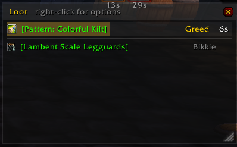
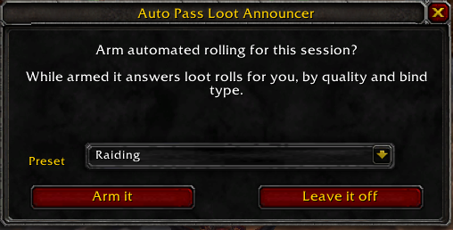
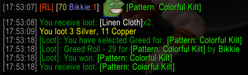

# Auto Pass Loot Announcer

Announces group loot drops **the moment they drop**, and rolls need, greed or pass for you based on item quality.

Built for raids where everyone is asked to pass on loot. Blizzard's "Pass on Loot" option is server side: with it on, the server never sends you the roll, so you never find out what dropped until people start looting. This addon replaces that option with automated passing you can actually see.


## Features

- **Presets** for whole sets of settings, so the night's raid rules and the way you loot a five-man are two clicks apart, with a one-line code to share either
- **Announces on the roll**, not on the corpse, so you see drops even when someone else loots the body
- **An optional loot window** that says what dropped as it drops — movable, resizable, scrollable — and can hold each roll a few seconds so you get one click to take any of it back
- **One line per item**, to your choice of channel
- **Roll actions per quality and per kind** — need, greed, pass, or leave the window up, set separately for BoP, BoE and stackable BoE drops, so the epic gems pass themselves while a BoE pattern off the same boss stops and waits for you
- **Single announcer election** — when several people in the group run the addon, they agree on one announcer so the drop is posted once, with nothing to configure
- **Never armed between sessions** — automated rolling starts each login off, on, or behind a prompt, whichever you pick
- **A drop popup** that appears when something drops, says what it was and goes again — the pack's haul read in the quiet after the pull, never on screen during one
- **Pepe mode**, which puts a random cheerful pepe in front of every announcement

## Screenshots




## Usage

Left-click the minimap button to arm or disarm automated rolling. Right-click opens the options, middle-click turns the loot window on and off.

Armed is never carried between sessions. What happens at login is the **At login** button beside the "Roll automatically" checkbox — click it to cycle:

| | |
| --- | --- |
| Off | Stays disarmed until you arm it yourself. The default |
| On | Armed straight away, on the preset you were last using |
| Ask | A prompt each login, so it is never armed without you saying so |

**At login is an account setting, not part of a preset** — it is a question about this session rather than about a role, and on **Ask** the prompt is where you pick the role anyway. That prompt carries a preset dropdown, already set to the one you were last using: pick a different one and it switches there and then, whether or not you go on to arm. **Leave it off** and Escape both mean disarmed.



| | |
| --- | --- |
|  | Idle, automated rolling off |
|  | Armed, the arrows turn green |

For the addon to see rolls at all, Blizzard's own **Pass on Loot** option must be **off** (Interface → Combat). That option suppresses the roll server side and no addon can work around it.

### Presets

The addon's settings live in **presets**. The dropdown at the top of the options panel switches between them, and the entries under the list make, rename and delete them; what a preset does and does not carry is spelled out below. Like the rest of the addon, they are per account rather than per character.

You start with one, called **Preset 1**, holding whatever you already had — a first run of this version changes nothing and there is nothing to set up. Rename it to something you recognise, then fork the next one off it.

| Menu entry | Effect |
| --- | --- |
| A preset's name | Switch to it |
| New from current... | A copy of what you have now, under a new name |
| Rename... | Rename the one you are on |
| Delete *name* | Delete the one you are on. The last one cannot be deleted |
| Share code... | Open the code window |

There is no Save button, deliberately. The live settings **are** the active preset, so a change you make is already in it; switching away files the one you are leaving and brings the other one in.

| | |
| --- | --- |
| **In a preset** | Announce on or off, the quality threshold, the channel cap, the chat prefix, pepe mode, the loot window and its grace period, the drop popup, the Show threshold, and all three roll grids |
| **Not in a preset** | **At login**, where the windows sit, whether the minimap button is shown, the drop log itself, the debug flag |

The second list is the things that belong to the account rather than to a role you switch into — a preset that moved your minimap button would be moving the control you switch presets with. Armed is not in a preset either; it is never remembered between sessions at all.

#### Share codes

**Share code...** in the preset menu opens a window holding the active preset as one line. Ctrl+A then Ctrl+C copies it. Paste someone else's in instead and **Import as new preset** adds it alongside the ones you have and switches to it — it never writes over a preset you already had.

Two to start from, if you want somewhere to begin. Paste either into the code window, or after `/apla preset import`:

**Raider** — pass on everything, but stop on a bind-on-equip that does not stack, because somebody may have been waiting weeks for it. Announce rare and better, up to raid.

```
APLA1:n=Raider,a=1,c=3,q=3,pe=0,t=0,tq=2,bop=pppp,boe=pwww,bes=pppp,p=Drop%3A
```

**Looter** — greed everything, decide epics and legendaries yourself. Announce uncommon and better, up to party, and log what dropped.

```
APLA1:n=Looter,a=1,c=2,q=2,pe=0,t=1,tq=2,bop=ggww,boe=gggg,bes=gggg,p=Drop%3A
```

A code pasted straight after `/apla preset`, with no keyword, is recognised as one.

**The format** is labelled fields rather than a positional CSV, so a code written by a different version still imports as much of itself as this one understands: unknown fields are ignored and missing ones fall back to the default. A code written before **At login** left the presets carries an `la` field, which is one of the fields now ignored.

| Field | |
| --- | --- |
| `APLA1` | The format version |
| `n` | Name |
| `a` | Announce to chat, 0 or 1 |
| `c` | Channel cap, 1 say to 4 yell |
| `q` | Announce threshold, 0 to 5 |
| `pe` | Pepe mode |
| `tq` | The Show threshold |
| `h` | Loot window on or off |
| `g` | Grace period in seconds, 0 for none |
| `f` | Drop popup time in seconds, 0 for no popup |
| `bop`, `boe`, `bes` | The three roll grids, one letter per quality from uncommon up: `w`indow, `p`ass, `g`reed, `n`eed |
| `p` | Chat prefix |

Anything but a letter, digit or `-_.` in a name or a prefix is percent-escaped, so a code is always one whitespace-free token that survives any copy and paste. That is why `Drop:` reads as `Drop%3A` above.

### Roll actions

Pick a quality with the tabs, then set what happens to each **kind** of drop at that quality:

| Kind | What lands here |
| --- | --- |
| BoP | Bind-on-pickup — tier tokens, boss gear, BoP reagents |
| BoE | Bind-on-equip and does **not** stack — patterns, recipes, BoE weapons and armour |
| BoE stack | Bind-on-equip and stacks — epic gems, motes and primals, void crystals, nether vortexes |

Hovering a row name in the panel shows the same thing with examples.

Each kind gets one action:

| Action | Result |
| --- | --- |
| Window | Nothing happens, the roll window stays on screen for you |
| Pass | Passes immediately |
| Greed | Greeds, and auto-confirms the bind-on-pickup prompt |
| Need | Needs, auto-confirms, and prints a local notice |

**Poor and common are left alone entirely** — no auto-roll, the window stays up exactly as it would without the addon running. Uncommon, rare, epic and legendary each get the same three rows.

The point of the split is that quality on its own is a poor guide to whether a drop is worth stopping for. At epic, all three kinds want different answers:

| Drop | Kind | Typical setting |
| --- | --- | --- |
| Tier token, boss gear | BoP | Pass |
| Pattern, BoE weapon | BoE | Window — somebody has been waiting for it |
| Epic gem, nether vortex | BoE stack | Pass — it is a commodity |

**Where the answers come from.** Bind type is the roll's own `bindOnPickUp` from `GetLootRollItemInfo`, which is the server's answer for that exact roll. Stackability is `itemStackCount` from `GetItemInfo` — the item's maximum stack size, not the number that dropped, so a single epic gem still reads as stackable.

`GetItemInfo` returns nothing until the client has cached the item, and unlike bind type there is no roll-level fallback for stack size. The addon retries for a few seconds against a two-minute roll, and only waits on an answer it will actually use — a BoP drop never waits on its stack size. If something still has not resolved, the roll is left alone rather than guessed at.

Bind-on-pickup prompts are only auto-confirmed for rolls the addon made itself. A prompt raised by your own click still waits for you.

### Loot window

Off by default. **Loot window** at the bottom of the options panel cycles through the settings; it is one control because the two things people asked for are points on one line, from "tell me nothing" through "tell me" to "tell me and wait for me".

| Loot window | What happens |
| --- | --- |
| Off | No window. Rolls are answered the moment they drop and Blizzard's roll windows are left alone — exactly as without this setting |
| Drops only | A window lists what dropped and who took it, as it happens. Rolls are still answered straight away |
| 3s / 5s / 8s / 12s | Also holds each roll the addon is going to answer for that long, counting down, so you can take one back |


**Once it is on, it stays on screen.** It does not appear and vanish — a window that comes and goes is one you cannot find, aim at, or resize. Turning it off is how you get rid of it, and the **X** in its header does exactly that.

```
┌ Loot ─────────── right-click for options ── X ┐
│▓▓▓▓▓▓▓▓▓▓▓▓▓▓▓▓▓▓▓▓▓▓▓▓▓▓▓▓░░░░░░░░░░░░░░░░░░│
│▓[Pattern: Swiftheal Mantle]▓▓▓▓▓▓▓▓ Pass   3s░│   ← green, draining left
│▓▓▓▓▓▓▓░░░░░░░░░░░░░░░░░░░░░░░░░░░░░░░░░░░░░░░│
│▓[Heart of Darkness] x2░░░░░░░░░░░░░ Pass   1s░│   ← red, nearly out
├───────────────────────────────────────────────┤
│ Bloodfist Helmet ..................... Isaari │
│ Heart of Darkness x2 ................. nobody │
│ Heart of Darkness x3 ................ Aereora │
│ Mark of the Illidari x12 ............ Perhorn │
└──────────────────────────────────────────────◢┘
```

Above the line are pending rolls. **The countdown is the row itself**: a band the full width of it, draining away leftwards behind the item name, so how long is left reads from the corner of your eye without the number being read. It warms from green through amber to red as it goes. The seconds are there beside it for when you want the exact figure.

Below the line, what already happened, **totalled per person**: three Hearts of Darkness that all went to Aereora are one row reading `x3` rather than three lines, because what this window is being asked is who ended up with what. A drop still waiting for a name keeps a row of its own — how many are in the air is worth seeing rather than summing — and a drop still pending above is not repeated below.

#### Moving, sizing, closing

| | |
| --- | --- |
| Move | Drag the header, or anywhere on the body |
| Resize | The grip in the bottom-right corner. Taller shows more lines |
| Scroll | The list scrolls when there is more than fits |
| Close | The **X**, or `/apla window` |

Position and size are remembered between sessions, per account. It sits on a low frame strata on purpose: it is always up, so anything you open — bags, the character sheet, a merchant — comes over the top of it rather than the other way round.

#### Right-click for options

Right-clicking anywhere on it — header, body or a row — opens a short menu:

| | |
| --- | --- |
| Show | The quality threshold, as the qualities themselves: **Uncommon and better** up to **Legendary only**, each in its own colour with a tick on the one in force |
| Clear the drop log | Empties the log and starts a new session. Asks first, unless there is nothing to lose |
| Close this window | Same as the X |

The threshold is one setting shared by this window and the popup, and it starts at **uncommon**: nothing below that is ever logged, because the server only rolls for items at the group's loot threshold and up. Offering the qualities by name and colour rather than as a slider position means you pick the thing you want by looking at it instead of translating a position into a quality.

#### Taking a roll back

**Click a pending row.** The auto-roll is dropped and Blizzard's own window opens for that item with the **full remaining roll timer** on it — around 115 of the server's 120 seconds. Nothing here shortens a roll.

There are deliberately no need/greed/pass buttons. The UI built for that decision is one click away and is better at it; with them in here, people would click every row and this would have become Blizzard's roll window with a shorter timer, which is worse than either.

**Doing nothing still rolls for you.** That is what keeps this from being that window:

| | Blizzard's roll window | This |
| --- | --- | --- |
| Doing nothing | loses you the item | rolls as configured |
| Frames on screen | one per item, up to four | one, a row per item |
| Clicks in a normal night | one per item | none |

Blizzard's window is only held back for rolls the addon has taken responsibility for. Anything set to **Window** in the grid, or below uncommon, or that the addon could not identify, gets its normal frame exactly as before.

Both settings are part of a preset, so a raid preset can run the window off and a five-man preset at 8 seconds. `/apla grace <0-60>` sets the hold and turns the window on with it; `/apla window` toggles the window and takes the hold down with it, because a roll held back with nowhere to see it is worse than either setting alone.

#### Trying it out

Group loot rolls only happen in a group, on Group Loot or Need Before Greed — solo, nothing is ever rolled for, so none of this can be tested alone. What **can** be tested alone is the popup: the **Test** button fakes a pull's worth of drops so you can see it appear, fill up and go, and drag it somewhere while it is there. Nothing about it is real — nothing announced, nothing rolled for, nothing logged.

#### What counts as a drop

**Only what the group was actually offered:** an item the server rolled for — the window you would have answered without this addon — and, under master loot, one a loot addon announced. Nothing else.

That rule exists because `CHAT_MSG_LOOT` cannot tell a drop from anything else that arrives through the loot system, and it is not a small difference:

| Reads as loot | Is it a drop? |
| --- | --- |
| Soul Dust, Lesser Astral Essence | No — someone disenchanted the green they just won |
| Tainted Core, Vashj's Vial Remnant | No — fight mechanics that happen to be items |
| Greys and commons in a group | No — those are handed out round-robin, no roll, no window |
| Quest pickups, herbs, anything you loot solo | No |
| The green the party rolled on | **Yes** |
| A stack of Nether Vortex someone won | **Yes** |
| A tier token the master looter handed out | **Yes**, if a loot addon announced it |

So `START_LOOT_ROLL` is what makes an item loggable and the loot message only says who ended up with it. An item stays loggable for ten minutes after it is offered, which covers the roll's two minutes and the wait for someone to loot the corpse.

The roll says how many dropped as well as what did, so a stack is a drop like any other: logged when it drops, reading `nobody`, with the number that dropped on it and a name once somebody loots it. Ten hearts off a night of trash are ten entries rather than one running total — which is what lets the popup say `x2` for the two that just dropped while the loot window adds them up per winner.

**One consequence worth knowing:** solo, nothing is ever rolled for, so nothing is logged. The log is a record of what the group was offered, not of what you picked up.

**Show filters what you are looking at, not what gets kept.** Everything that qualifies goes into the log; the threshold on the right-click menu decides how far down the list you want to see. Set it to Rare for a raid night and the greens are still there when you set it back.

A threshold on the way in would throw away rows you could never ask for again; a filter on the way out can always be widened.

Two more things follow:

- **You only log what you were there for.** Loot taken while you are offline, or before you joined the group, never happened as far as the addon is concerned.
- **Pairing a winner to a drop is a heuristic.** A loot message is matched to the oldest row for that item still waiting on a winner, within three minutes — thirty for an announced one, since a loot master takes longer than a roll. A row waiting on the same number as the message wins over an older one, which is what tells two stacks of the same item apart. If the same item drops off two mobs seconds apart, two winners could in principle still land on the wrong rows. It is cosmetic when it happens.

The log holds 1000 rows and drops the oldest beyond that — a long while, now that it only holds what was rolled for. It is shared across all your characters, kept between logins, and emptied only by **Clear the drop log** on the right-click menu.

### Drop popup

Off by default. **Drop popup** at the bottom of the options panel cycles: off, 3, 5 or 10 seconds.

A second window, and deliberately not the loot window in another guise. The loot window is a fixture — you turn it on, it stays where you put it, and it is where a roll counts down and where you click to take one back. A window you may have to *answer* is a window that has to stay.

This is the opposite. It appears when something drops, says what it was, and goes. It is the thing you glance at in the quiet after a pull, while the healer drinks and somebody is looting.

```
┌───────────────────────────────────────────────┐
│ [Helm of the Vanquished Hero] ..... Stinkaapje│
│ [Nether Vortex] x2 ..................... Hikø │
│ [Belt of One-Hundred Deaths] ....... Kasplant │
└───────────────────────────────────────────────┘
        appears on a drop, gone a few seconds later
```

| | |
| --- | --- |
| Appears | When something drops that the **Show** threshold lets through |
| Once per drop | A winner's name landing on a drop already shown does not bring it back — it is redrawn in place if the window is still up, and nothing more |
| A whole pack | Each drop puts the clock back to the full time, so a pull arrives as one window rather than as five |
| Goes | When the drops stop and the time runs out |
| Emptied | On the way out, so the next pull opens on a clean window rather than the tail of the last one |
| In combat | Never |
| Rolls | Nothing to do with them: no grace period, no countdown, nothing to answer |

**It is never on screen in a fight.** What drops while you are fighting is held back and shown the moment you are not — the pack's haul in one go, once there is time to read it. That is the point of it rather than a limitation: the window is for the recovery period, not for the pull.

It has no grace period and no countdown because it has nothing you must answer. Taking a roll back is the loot window's job, and that window stays up precisely because it might need you. Run both if you want both.

**Moving and sizing it.** It has no header — a window this brief cannot spare the room — so it is dragged by its body *and by its rows*, which would otherwise swallow the drag. The grip in its bottom-right corner sizes it. Both are remembered per account.

The height works two ways, and which one you get depends on where you leave that grip:

| | |
| --- | --- |
| **Squashed to one row** | It grows and shrinks with the pack — one drop is one line, five is five |
| **Pulled down past one row** | It is that height every time, full or not, and anything past it scrolls on the mouse wheel |

One row is the smallest the grip goes, so "as small as it will go" is also how you ask for no fixed height at all. Either way the newest is at the top, so a full window is always showing the thing that just dropped; the wheel goes back through the rest. It holds twenty rows and shows at most ten at once.

Having hold of it — dragging it, or sizing it — keeps it on screen, the same as resting the mouse on it does. A window that faded out from under a resize would be one you could not resize.

Because it only appears when something drops, there would otherwise be no way to find it to put it anywhere: so **cycling the Drop popup button shows it**, with a placeholder row to aim at, and **Test** fakes a whole pull so there is something to size it against. It fades on its own like any other showing.

Right-click to put it away early, shift-click a row to link it in chat. It fades rather than blinking out. The drop log keeps everything either way — the wipe is what the popup is showing, not what was recorded.

It shares the **Show** threshold with the loot window: one answer to "what is worth showing me", set in one place.

`/apla popup <0-60>` sets the time, `/apla popup` on its own toggles it. It is part of a preset, so a raid preset can run it and a five-man preset leave it off.

### Announcing

Two settings: **Announce** sets the minimum quality, **Announce up to** sets the widest channel. The channel is a cap that steps down to whatever is available:

| Cap | In raid | In party | Solo |
| --- | --- | --- | --- |
| Say | say | say | say |
| Party | your subgroup | party | own chat frame |
| Raid | raid | party | own chat frame |
| Yell | yell | yell | yell |

### Pepe mode

Pepe mode prepends a random happy pepe to each announcement, picked from 22 of
the cheerful ones in [Twitch Emotes 2.0](https://www.curseforge.com/wow/addons/twitch-emotes-v2).
It never repeats the emote it used last.



They are all still frames. Twitch Emotes animates an emote by rewriting the
whole chat line 30 times a second, which stops an item tooltip on that line
from settling, so the animated pepes are kept out of the pool.

What goes out on the wire is the emote's name, so it becomes a picture only for
readers who run Twitch Emotes themselves. Everyone else sees the word, e.g.
`PepePogO Drop: [Cursed Vision of Sargeras]`. That addon is not a dependency of
this one and nothing breaks without it.

### Slash commands

| Command | Effect |
| --- | --- |
| `/apla` | Open the options panel (`/lap` also works) |
| `/apla pass` | Arm or disarm automated rolling |
| `/apla preset` | List the presets |
| `/apla preset <name or number>` | Switch to one |
| `/apla preset new <name>` | New preset, copied from the current settings |
| `/apla preset rename <name>` | Rename the one you are on |
| `/apla preset delete <name or number>` | Delete one |
| `/apla preset code` | Open the share-code window |
| `/apla preset import <code>` | Import a code as a new preset |
| `/apla set <bop\|boe\|stack\|all> <2-5> <window\|pass\|greed\|need>` | Set the action for one quality and kind |
| `/apla channel <say\|party\|raid\|yell>` | Set the announce channel cap |
| `/apla quality <0-5>` | Minimum quality to announce |
| `/apla announce` | Toggle chat output (off prints locally) |
| `/apla login <off\|on\|ask>` | What automated rolling does at login |
| `/apla grace <0-60>` | Seconds to hold a roll before answering it; 0 answers straight away |
| `/apla window` | Open or close the loot window (`/apla roll` also works) |
| `/apla popup [0-60]` | Seconds the drop popup shows for; no number toggles it, 0 turns it off |
| `/apla pepe` | Toggle pepe mode |
| `/apla who` | Show the elected announcer and all peers |
| `/apla debug` | Log every roll decision |
| `/apla minimap` | Show or hide the minimap button |

## Development

The repository root **is** the addon folder. Point the game at it with a directory junction instead of copying files:

```cmd
mklink /J "<your WoW folder>\_anniversary_\Interface\AddOns\AutoPassLootAnnouncer" "<your clone>"
```

Edit in VS Code, then `/reload` in game. Recommended extensions are in `.vscode/extensions.json`; the WoW API one gives you completion for the Blizzard functions.

Before committing:

```cmd
luac5.1 -p AutoPassLootAnnouncer.lua
luacheck .
```

CI runs both on every push. See `docs/RELEASING.md` for how the CurseForge side works.

## Layout

```
AutoPassLootAnnouncer.toc    metadata, load order
AutoPassLootAnnouncer.lua    the addon
Textures/                    minimap icons (32-bit uncompressed TGA, 64x64)
Media/                       screenshots and icon art, excluded from the package
docs/                        release notes for maintainers
.pkgmeta                     tells the CurseForge packager what to ship
```

## License

MIT, see [LICENSE](LICENSE).
