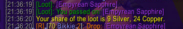
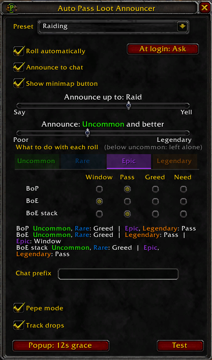

# Auto Pass Loot Announcer

Announces group loot drops **the moment they drop**, and rolls need, greed or pass for you based on item quality.

Built for raids where everyone is asked to pass on loot. Blizzard's "Pass on Loot" option is server side: with it on, the server never sends you the roll, so you never find out what dropped until people start looting. This addon replaces that option with automated passing you can actually see.



## Features

- **Announces on the roll**, not on the corpse, so you see drops even when someone else loots the body
- **One line per item**, to your choice of channel
- **Roll actions per quality and per kind** — need, greed, pass, or leave the window up, set separately for BoP, BoE and stackable BoE drops, so the epic gems pass themselves while a BoE pattern off the same boss stops and waits for you
- **Single announcer election** — when several people in the group run the addon, they agree on one announcer so the drop is posted once, with nothing to configure
- **Never armed between sessions** — automated rolling starts each login off, on, or behind a prompt, whichever you pick
- **Drop tracker** — an optional log of everything that dropped this session and who won it, kept across logouts until you clear it
- **Pepe mode**, which puts a random cheerful pepe in front of every announcement

## Screenshots



## Usage

Left-click the minimap button to arm or disarm automated rolling. Right-click opens the options, middle-click opens the drop log.

Armed is never carried between sessions. What happens at login is the **At login** button beside the "Roll automatically" checkbox — click it to cycle:

| | |
| --- | --- |
| Off | Stays disarmed until you arm it yourself. The default |
| On | Armed straight away |
| Ask | A prompt each login, so it is never armed without you saying so |

| | |
| --- | --- |
|  | Idle, automated rolling off |
|  | Armed, the arrows turn green |

For the addon to see rolls at all, Blizzard's own **Pass on Loot** option must be **off** (Interface → Combat). That option suppresses the roll server side and no addon can work around it.

### Roll actions

Pick a quality with the tabs, then set what happens to each **kind** of drop at that quality:

| Kind | What lands here |
| --- | --- |
| BoP | Bind-on-pickup — tier tokens, boss gear, BoP reagents |
| BoE | Bind-on-equip and does **not** stack — patterns, recipes, BoE weapons and armour |
| BoE stack | Bind-on-equip and stacks — epic gems, motes and primals, void crystals, nether vortexes |

Hovering a row name in the panel shows the same thing with examples.

Each kind gets one action:

| Action | Result |
| --- | --- |
| Window | Nothing happens, the roll window stays on screen for you |
| Pass | Passes immediately |
| Greed | Greeds, and auto-confirms the bind-on-pickup prompt |
| Need | Needs, auto-confirms, and prints a local notice |

**Poor and common are left alone entirely** — no auto-roll, the window stays up exactly as it would without the addon running. Uncommon, rare, epic and legendary each get the same three rows.

The point of the split is that quality on its own is a poor guide to whether a drop is worth stopping for. At epic, all three kinds want different answers:

| Drop | Kind | Typical setting |
| --- | --- | --- |
| Tier token, boss gear | BoP | Pass |
| Pattern, BoE weapon | BoE | Window — somebody has been waiting for it |
| Epic gem, nether vortex | BoE stack | Pass — it is a commodity |

**Where the answers come from.** Bind type is the roll's own `bindOnPickUp` from `GetLootRollItemInfo`, which is the server's answer for that exact roll. Stackability is `itemStackCount` from `GetItemInfo` — the item's maximum stack size, not the number that dropped, so a single epic gem still reads as stackable.

`GetItemInfo` returns nothing until the client has cached the item, and unlike bind type there is no roll-level fallback for stack size. The addon retries for a few seconds against a two-minute roll, and only waits on an answer it will actually use — a BoP drop never waits on its stack size. If something still has not resolved, the roll is left alone rather than guessed at.

Bind-on-pickup prompts are only auto-confirmed for rolls the addon made itself. A prompt raised by your own click still waits for you.

### Drop tracker

Off by default. Turn it on with **Track drops** in the options, then **middle-click the minimap button** to open the log.

A session lasts as long as you leave it. The log is saved between logins and emptied only by the **Clear** button, so a night of trash runs with a logout in the middle is still one list.

Two tabs: **Everything**, and **Mine** for what the character you are on took. Mine is per character, not per account — a winner's name is the only thing that says whose a drop was, and the log is shared between your characters.

| | |
| --- | --- |
| Non-stackable | One row per drop, with the winner's name |
| Stackable | One row per item, with a running total, sorted to the top |
| Nothing yet | A row that says `nobody` is a drop that was rolled but never picked up |

Stacked rows sit above the rest in both tabs. They are the part of the list that stays the same length however long the night runs, so they belong where they can be read at a glance. Everything else follows, newest first.

The window resizes from the grip in its bottom-right corner and remembers both size and position. Hovering a row shows the item tooltip; shift-clicking drops the link into whatever you are typing. The slider at the bottom sets how far down the log goes, and the header carries the session start and a running coin total.

Rows come from `CHAT_MSG_LOOT`, which is the only thing the client sends that carries a winner's name or says how many of something changed hands. `START_LOOT_ROLL` adds a row too, but only for items that do not stack: it fires before anyone has won, so the row waits with no winner until a loot message fills it in. Stackables are left to the loot message alone, because counting them from both events would count them twice.

Two things follow from that:

- **You only log what you were there for.** Loot taken while you are offline, or before you joined the group, never happened as far as the addon is concerned.
- **Pairing a winner to a drop is a heuristic.** A loot message is matched to the oldest row for that item still waiting on a winner, within three minutes. If the same item drops off two mobs seconds apart, two winners could in principle land on the wrong rows. It is cosmetic when it happens.

The log holds 500 rows and drops the oldest beyond that, which is far more than a night of trash once stackables have collapsed. It is shared across all your characters, like the rest of the addon's settings.

### Announcing

Two settings: **Announce** sets the minimum quality, **Announce up to** sets the widest channel. The channel is a cap that steps down to whatever is available:

| Cap | In raid | In party | Solo |
| --- | --- | --- | --- |
| Say | say | say | say |
| Party | your subgroup | party | own chat frame |
| Raid | raid | party | own chat frame |
| Yell | yell | yell | yell |

### Pepe mode

Pepe mode prepends a random happy pepe to each announcement, picked from 22 of
the cheerful ones in [Twitch Emotes 2.0](https://www.curseforge.com/wow/addons/twitch-emotes-v2).
It never repeats the emote it used last.

They are all still frames. Twitch Emotes animates an emote by rewriting the
whole chat line 30 times a second, which stops an item tooltip on that line
from settling, so the animated pepes are kept out of the pool.

What goes out on the wire is the emote's name, so it becomes a picture only for
readers who run Twitch Emotes themselves. Everyone else sees the word, e.g.
`PepePogO Drop: [Cursed Vision of Sargeras]`. That addon is not a dependency of
this one and nothing breaks without it.

### Slash commands

| Command | Effect |
| --- | --- |
| `/apla` | Open the options panel (`/lap` also works) |
| `/apla pass` | Arm or disarm automated rolling |
| `/apla set <bop\|boe\|stack\|all> <2-5> <window\|pass\|greed\|need>` | Set the action for one quality and kind |
| `/apla channel <say\|party\|raid\|yell>` | Set the announce channel cap |
| `/apla quality <0-5>` | Minimum quality to announce |
| `/apla announce` | Toggle chat output (off prints locally) |
| `/apla login <off\|on\|ask>` | What automated rolling does at login |
| `/apla loot` | Open or close the drop log |
| `/apla track` | Toggle drop tracking |
| `/apla pepe` | Toggle pepe mode |
| `/apla who` | Show the elected announcer and all peers |
| `/apla debug` | Log every roll decision |
| `/apla minimap` | Show or hide the minimap button |

## Development

The repository root **is** the addon folder. Point the game at it with a directory junction instead of copying files:

```cmd
mklink /J "<your WoW folder>\_anniversary_\Interface\AddOns\AutoPassLootAnnouncer" "<your clone>"
```

Edit in VS Code, then `/reload` in game. Recommended extensions are in `.vscode/extensions.json`; the WoW API one gives you completion for the Blizzard functions.

Before committing:

```cmd
luac5.1 -p AutoPassLootAnnouncer.lua
luacheck .
```

CI runs both on every push. See `docs/RELEASING.md` for how the CurseForge side works.

## Layout

```
AutoPassLootAnnouncer.toc    metadata, load order
AutoPassLootAnnouncer.lua    the addon
Textures/                    minimap icons (32-bit uncompressed TGA, 64x64)
Media/                       screenshots and icon art, excluded from the package
docs/                        release notes for maintainers
.pkgmeta                     tells the CurseForge packager what to ship
```

## License

MIT, see [LICENSE](LICENSE).
